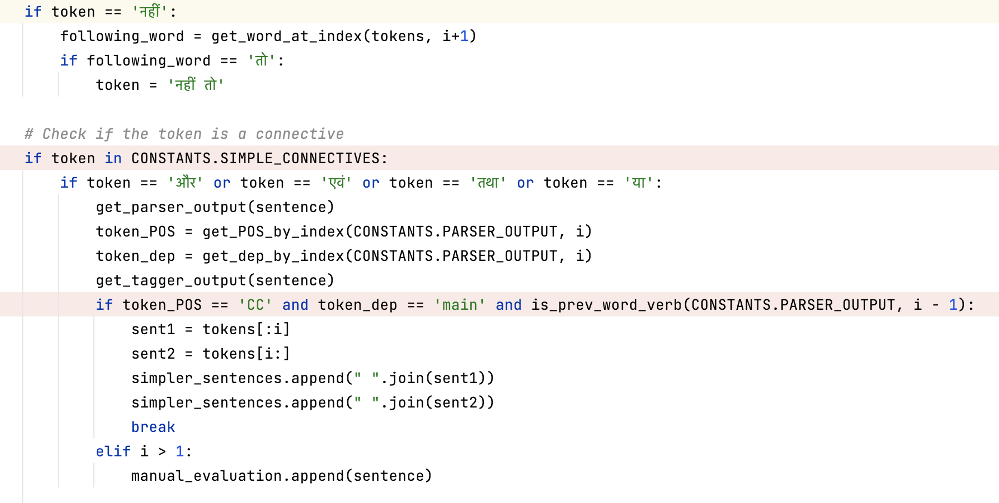

### Introduction:

- The purpose of sentence simplification is to take complex or lengthy sentences and restructure them in a way that makes them easier to be converted to USR while preserving the original meaning.
- Sentences are broken down based on a list of connectives.

### Installation:

1. To setup a new project - 
Visit https://bitbucket.org/iscnlp/workspace/repositories/ to install the following in mentioned order - 

    Tokenizer
    - git clone https://irshadbhat@bitbucket.org/iscnlp/tokenizer.git
    - cd tokenizer
    - sudo python setup.py install
    - cd ..

    Pos-tagger
    - git clone https://irshadbhat@bitbucket.org/iscnlp/pos-tagger.git
    - cd pos-tagger
    - sudo python setup.py install
    - pip install -r requirements.txt
    - cd ..

    Parser
    - git clone https://irshadbhat@bitbucket.org/iscnlp/parser.git
    - cd parser
    - sudo python setup.py install
    - pip install -r requirements.txt
    - cd ..

2. clone the module available on Github: https://github.com/FatemaBawahir/USR_Generation/tree/master/sentence_simplification

### Input Format:

1. The input file is plain text.
2. It can contain one or more sentences for simplification.
3. Input Format:

   **"sentence_id" &nbsp; "sentence"**

   Where:
   - sentence_id: An identifier for the sentence. It can be an alphanumeric value or a unique numerical identifier.
   - space or " ": A non-breaking space character that separates the sentence_id from the sentence. One or more spaces are allowed.
   - sentence: The actual text of the sentence. It can contain letters, numbers, punctuation, and other characters.

   Example:
   12345&nbsp;पिछले अध्याय में आप पढ़ चुके हैं कि हमारी पृथ्वी गोलाकार नहीं है।.
   
   Explanation:
   In the given input format, '12345' is the sentence_id, and 'This is a sample sentence.' is the sentence.
   In the above representation, &nbsp; is a non-breaking space, which ensures that the space between sentence_id and sentence is maintained.

4. Example input file - 
   - Geo_ncert_6stnd_2ch_0023  इस प्रकार, विषुवत् वृत्त पृथ्वी पर एक काल्पनिक वृत्त बनाती है एवं यह पृथ्वी पर विभिन्न स्थानों की स्थिति बताने का सबसे महत्त्वपूर्ण संदर्भ बिंदु है। 
   - Geo_ncert_6stnd_2ch_0028  इस प्रकार 90 अंश उत्तरी अक्षांश उत्तर ध्रुव को दर्शाता है तथा 90 अंश दक्षिणी अक्षांश दक्षिण ध्रुव को। 
   - Geo_ncert_6stnd_2ch_0049  ये अर्धवृत्त हैं तथा उनके बीच की दूरी ध्रुवों की तरफ बढ़ने पर घटती जाती है एवं ध्रुवों पर शून्य हो जाती है, जहाँ सभी देशांतरीय याम्योत्तर आपस में मिलती हैं।

### Output Format:

1. The output file is plain text.
2. Output Format:

   **"Sentence_id with letter to show subparts"&nbsp; "Sentence"&nbsp; "Tag"**

   Where:
   - Sentence_id with letter to show subparts: An identifier for the sentence with additional letter(s) to indicate subparts, if applicable.
   - space or " ": A non-breaking space character that separates the sentence_id from the sentence.
   - Sentence: The actual text of the sentence, which can contain letters, numbers, punctuation, and other characters.
   - Tag: Indicates if there is any specific evaluation required.
     - None - represents that the sentence does not require any manual attention.
     - Manual Evaluation - represents that the sentence had a connective but is still not broken. This is to inform the annotators some manual attention is required.
4. For each input broken into subparts, letters a, b, c etc. are appended to the sentence_id. If the sentence is not broken then nothing is appended.
5. All subparts end with a space and a poornaviram.
6. Example output file - 
   - Geo_ncert_6stnd_2ch_0023a  इस प्रकार, विषुवत् वृत्त पृथ्वी पर एक काल्पनिक वृत्त बनाती है ।  None 
   - Geo_ncert_6stnd_2ch_0023b  एवं यह पृथ्वी पर विभिन्न स्थानों की स्थिति बताने का सबसे महत्त्वपूर्ण संदर्भ बिंदु है ।  None 
   - Geo_ncert_6stnd_2ch_0028  इस प्रकार 90 अंश उत्तरी अक्षांश उत्तर ध्रुव को दर्शाता है तथा 90 अंश दक्षिणी अक्षांश दक्षिण ध्रुव को ।  Manual evaluation 
   - Geo_ncert_6stnd_2ch_0049  ये अर्धवृत्त हैं तथा उनके बीच की दूरी ध्रुवों की तरफ बढने पर घटती जाती है एवं ध्रुवों पर शून्य हो जाती है, जहाँ सभी देशांतरीय याम्योत्तर आपस में मिलती हैं ।  Manual evaluation

### Connectives List:

1. SIMPLE_CONNECTIVES = ['और', 'एवं' ,'इसलिए', 'क्योंकि', 'जबकि' ,'तथा', 'ताकि', 'मगर', 'लेकिन', 'किंतु', 'परंतु', 'फिर', 'या', 'तथापि','नहीं तो', 'व', 'चूंकि', 'चूँकि', 'वरना','अन्यथा', 'बशर्तें', 'हालाँकि', 'इसीलिये', 'इसीलिए' , 'इसलिए', 'अथवा', 'अतः', 'अर्थात्', 'जब', 'तो']
2. COMPLEX_CONNECTIVES = 
{ 'चूँकि' : ['अतः'],                     
'जब' : ['तब', 'तो'],
'अगर' : ['तो', 'तब'],
'यदि' : ['तो'],
'यद्यपि' : ['फिर भी'], }

### Major modules in sentence simplification:

Syntax - **module_name(parameter_list):** 

1. validate_sentence(sentence) :
This function ensures that input sentence is- 
   - not empty
   - not only numeric values

2. sanitize_input(sentence):
This function ensures that input sentence is-
   - converted to WX convention
   - then each word is cleaned to remove Z from terms having dZ, jZ, DZ. For example - wx conversion of चढ़ी is 'caDZI'. After cleaning it will become 'caDI'. Its corresponding hindi conversion is 'चढी'. This makes it parser compatible.
   - convert each word back to hindi
   - replace full stop if any with a space and a poornaviram at the end of sentence

3. breakAllPairedConnective(sentence, allPairedConnectiveList, manual_evaluation):
   - This is a recursive function which calls breakPairConnective(sentence, manual_evaluation) to break the input sentence based on the list of paired connectives.
   - It runs until all the sub parts of the input sentence cannot be further broken down by the list of paired connectives.
   - allPairedConnectiveList - contains the sentences after being processed upon by breakAllPairedConnective.
   - Manual_evaluation - contains the sentences which had a paired connective but could not be broken due to some unfulfilled condition.

4. breakPairConnective(sentence, manual_evaluation):
   - The sentence is broken down into tokens.
   - We iterate on the list of tokens. If we find a token which exists as a key in the paired connective list, we check the presence of its counterpart (value) in the sentence.
   - We find the index of its counterpart in the sentence, and check if the term just before the counterpart is a verb (VM or VAUX as tagged by pos-tagger)
     - If yes, we break the sentence on the counterpart, such that it is included in the second half. We drop the token identified as the key from the first half. 
     - If no,then we tag the sentence for manual evaluation.

5. breakAllSimpleConnective(sentence, allSimpleConnectiveList, manual_evaluation):
   - This is a recursive function which calls breakSimpleConnective(sentence, manual_evaluation) to break the input sentence based on the list of simple connectives.
   - It runs until all the sub parts of the input sentence cannot be further broken down by the list of simple connectives.
   - allSimpleConnectiveList - contains the sentences after being processed upon by breakSimpleConnective. This is the resultant list after all possible breakdown.
   - Manual_evaluation - contains the sentences which had a simple connective but could not be broken due to some unfulfilled condition.

6. breakSimpleConnective(sentence, manual_evaluation):
   - The sentence is broken down into tokens.
   - We iterate on the list of tokens. If we find a token which exists in the list of simple connectives, we call the pos-tagger to find if the previous term is verb(VM or VAUX as tagged by pos-tagger)
     - If yes, we break the sentence on the connective, such that it is included in the second half. 
     - If no,then we tag the sentence for manual evaluation. 
   - If no connective was found, we keep iterating over the list of tokens.

### Exceptional flow:

For simple connectives, some of them are handled in a different way - 
1. 'नहीं तो':
If  नहीं exists in the sentence, we check if it is followed by तो. If yes then check if the previous term of नहीं is a verb and then break the sentence accordingly.
2. 'और', 'एवं', 'तथा', 'या':
If any of the above connectives is found, we call the parser output and check if its POS_tag is CC and its dependency is main.
If yes then we break the sentence otherwise tag it for manual evaluation.
3. The conditions to add Manual evaluation tag are-
   - a connective exists in the sentence
   - the connective is not the first word of the sentence
   - due to some unfulfilled condition the sentence could be broken on the connective

### Performance Considerations:

Some known limitations are -
1. For all the subparts of the sentence we call the pos tagger.
2. For large inputs, the script takes time to generate output.

### Scope of Improvement:

- Optimise the pos tagger calls to reduce the overall time taken by the program for execution.

